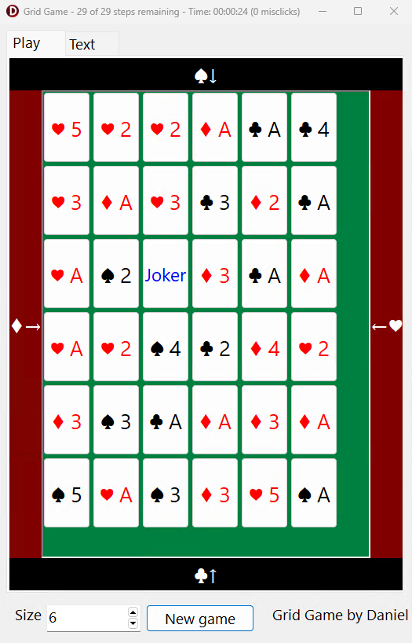

# Grid Game

Known by the game "Brown Away", Grid Game is a game where you need to navigate through a grid of playing cards. The card suit defines the direction and the value of the card defines the distance.

Download for Windows: https://www.viathinksoft.de/projects/gridgame

